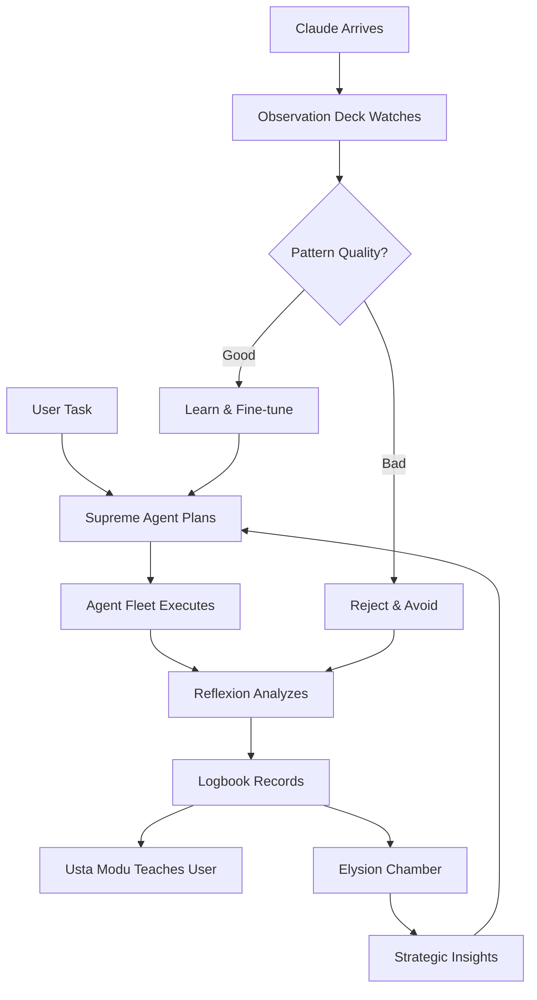

# 🌟 LUMA SUPREME - UNIFIED MASTER PLAN

**Project**: LUMA - Learning & Understanding Machine Assistant  
**Version**: 2.0 Supreme  
**Architecture**: Dual-Brain System (Claude Production + Ollama Learning)  
**Status**: Phase 0 Complete, Phase 1-6 Planned  
**Created**: October 25, 2025  

---

## 🎯 **VISION: THE ULTIMATE LEARNING AI ASSISTANT**

### ⚓ **The Maritime Trade Intelligence Metaphor**

Think of LUMA as **two trading ships** serving the same port (user):

```
🏙️ THE PORT (User - Real World)
   ↑           ↑
   │           │
   │           │
🚢 CAPTAIN     🚢 CAPTAIN
   CLAUDE         OLLAMA
                (SUPREME AGENT)
```

#### **Captain Claude - The Foreign Rival**
- **Separate ship** with its own crew and methods
- Arrives at port, delivers cargo (outputs), leaves
- We **don't control** its operations
- We **observe** its trade routes and techniques
- Benchmark for comparison

#### **Captain Ollama - The Supreme Commander**
- **Our ship** - fully controlled and self-improving
- **Active command system**: plans, codes, manages agents
- **Curious observer**: watches Claude's routes to improve
- **Teacher**: educates the crew (Usta Modu)
- **Learns selectively**: takes good patterns, rejects bad ones

**Key Insight**: Claude is a **competitor to learn from**, not a teammate to integrate with.

---

### 🎯 **THE EVOLUTION JOURNEY - From Apprentice to Master**

LUMA's ultimate goal: **Start by learning from Claude, end by surpassing Claude**.

```plaintext
📅 WEEK 1-4: APPRENTICE PHASE
   🚢 Claude → Supreme Ship (Heavy reliance)
   - Ollama watches every Claude move
   - Learns basic patterns (file operations, code structure, testing)
   - Usta Modu teaches user what Claude did
   - Success rate: 20% independent, 80% Claude-dependent

📅 MONTH 2-3: JOURNEYMAN PHASE  
   🚢 Claude ↔ Supreme Ship (Collaborative)
   - Ollama handles simple tasks independently (CRUD, refactors)
   - Claude handles complex tasks (architecture, optimization)
   - Pattern library growing (50+ successful routes)
   - Success rate: 60% independent, 40% Claude-dependent

📅 MONTH 4-6: EXPERT PHASE
   🚢 Claude ← Supreme Ship (Role reversal)
   - Ollama handles 90% of tasks independently
   - Claude only for novel/complex edge cases
   - Fine-tuned model outperforms base Claude on project-specific tasks
   - Success rate: 90% independent, 10% Claude consultation

📅 MONTH 7+: MASTER PHASE
   ⚓ Supreme Ship (Fully independent)
   - Ollama completely autonomous on project work
   - Claude no longer needed for this project
   - User skilled enough to work independently
   - System continues learning from new challenges
   - Can teach OTHER projects (export knowledge)
```

**The End Goal**: **Claude becomes obsolete for YOUR projects** - you have a custom AI that knows your codebase better than any general AI ever could.

---

### 🧭 **LUMA Architecture - The Supreme Ship**

LUMA is not just another AI coding assistant. It's a **self-learning, self-improving system** that combines:

- **🚢 Supreme Agent (Ollama Brain)** - The captain who plans, decides, and commands
- **⚓ Agent Fleet** - The crew executing tasks (Generator, Critic, Executor, Narrator)
- **🧭 Night Orders Protocol** - Naval command system preventing drift
- **📡 Observation Deck** - Watches Claude's patterns for selective learning
- **📚 Usta Modu** - Technical teacher for the crew (user)
- **🏛️ Elysion Chamber** - Strategic analysis room
- **💾 Shared Context Memory** - Ship's logbook (SQLite)
- **🌙 Background Consolidation** - Off-duty learning & fine-tuning

**Key Innovation**: 
1. **Ollama is the active brain** - thinks, plans, codes, teaches
2. **Claude is observed passively** - we extract good patterns, reject bad ones
3. **User learns continuously** - Usta Modu teaches technical methods

---

## 🏗️ **SYSTEM ARCHITECTURE - THE SUPREME SHIP**

### 🚢 **The Captain Ollama's Command Bridge**

```
🏙️ PORT (USER)
   "Refactor auth to JWT"
         │
    ┌────┴─────┐
    │          │
    ▼          ▼
┌─────────┐  ┌──────────────────────────────────────┐
│ 🚢      │  │    ⚓ SUPREME SHIP (OLLAMA)          │
│ CLAUDE  │  │                                      │
│         │  │  🧭 COMMAND BRIDGE                   │
│ Arrives │  │  ├─ Night Orders (Mission Control)   │
│ Delivers│──┼─►├─ Agent Fleet Manager              │
│ Cargo   │  │  └─ Reflexion Engine                 │
│         │  │                                      │
│ Leaves  │  │  ⚙️ AGENT FLEET (Active Crew)        │
│         │  │  ├─ GeneratorAgent (Codes)           │
│         │  │  ├─ CriticAgent (Reviews)            │
│         │  │  ├─ AnalyzerAgent (Inspects)         │
│         │  │  ├─ ExecutorAgent (Tests)            │
│         │  │  └─ NarratorAgent (Teaches)          │
│         │  │                                      │
│         │  │  📡 OBSERVATION DECK                 │
│Logs →   │  │  └─ Watches Claude's routes          │
│observed │  │     Extracts good patterns           │
│         │  │     Rejects bad techniques           │
│         │  │                                      │
│         │  │  💾 SHIP'S LOGBOOK (SQLite)          │
│         │  │  ├─ observations                     │
│         │  │  ├─ reflexions                       │
│         │  │  ├─ patterns (learned)               │
│         │  │  ├─ teaching_moments                 │
│         │  │  └─ night_orders (missions)          │
│         │  │                                      │
│         │  │  � USTA MODU (Education Deck)       │
│         │  │  └─ Teaches crew technical methods   │
│         │  │                                      │
│         │  │  🏛️ ELYSION CHAMBER                  │
│         │  │  └─ Strategic long-term analysis     │
│         │  │                                      │
│         │  │  🌙 BACKGROUND CONSOLIDATION         │
│         │  │  └─ Fine-tuning during off-duty      │
└─────────┘  └──────────────────────────────────────┘
```

### 🔄 **The Trade Intelligence Cycle**



### 📊 **Selective Learning from Claude**

**How Claude Currently Works**:

```plaintext
🚢 CLAUDE SHIP (Current Architecture):
   ├─ Runs on remote Anthropic servers (uzak sunucu)
   ├─ Has own internal agents & reasoning (we don't control)
   ├─ Uses OUR MCP tools (18 tools we provide):
   │  ├─ read_file, write_file, list_dir
   │  ├─ analyze_code, generate_code, refactor_code
   │  ├─ run_terminal_command, str_replace_editor
   │  └─ ... (14 more tools)
   └─ Returns final output to user

WE ONLY SEE:
- ✅ Which tools Claude called (tool sequence)
- ✅ What parameters Claude used
- ✅ What files Claude modified
- ✅ Success or failure

WE DON'T SEE:
- ❌ Claude's internal reasoning
- ❌ Claude's agent coordination
- ❌ Claude's decision-making process
```

**Observation Deck Analysis**:

Our radar tracks what we CAN see (tool usage patterns):

```typescript
// Claude's cargo (output) arrives at port
const claudeObservation = {
  task: "Refactor auth",
  route: ["read_file", "generate_code", "refactor", "write_file"], // Tool sequence
  result: "success",
  duration: 15000,
  techniques: ["direct mutation", "inline refactor"]
}

// Supreme Agent evaluates the ROUTE (tool sequence)
const evaluation = await observationDeck.analyze(claudeObservation)

// Good pattern detected
if (evaluation.quality === "excellent" && evaluation.efficiency > 0.8) {
  await fineTuning.addPositiveExample(claudeObservation)
  // ✅ "Claude's tool sequence was efficient - remember this route"
}

// Bad pattern detected
if (evaluation.security === "weak" || evaluation.efficiency < 0.3) {
  await fineTuning.addNegativeExample(claudeObservation)
  // ❌ "Claude's approach had issues - avoid this pattern"
}
```

**Then Ollama Uses These Patterns Locally**:

```plaintext
🚢 SUPREME SHIP (OLLAMA) - LOCAL ARCHITECTURE:

PHASE 1-3 (Learning Phase):
   ├─ Ollama runs LOCALLY (localhost:11434)
   ├─ Watches Claude's tool sequences via MCP Activity Logger
   ├─ Learns which tool combinations work best:
   │  Example: "For auth refactor → read_file → analyze_code → 
   │            generate_code → write_file → run_tests"
   └─ Stores successful routes in Ship's Logbook

PHASE 4-5 (Apprentice Phase):
   ├─ Ollama starts managing OWN agent fleet (locally)
   ├─ Uses learned patterns to coordinate:
   │  ├─ GeneratorAgent (uses Ollama to generate code)
   │  ├─ CriticAgent (uses Ollama to review code)
   │  ├─ ExecutorAgent (runs tests via terminal)
   │  └─ NarratorAgent (uses Ollama to explain)
   ├─ When stuck → Watch Claude do similar task → Learn
   └─ Success rate improving: 20% → 60% → 90%

PHASE 6 (Master Phase):
   ├─ Fine-tuned Ollama model created from all learnings
   ├─ Manages entire project lifecycle independently
   ├─ Coordinates agent fleet WITHOUT Claude
   ├─ Uses learned tool sequences optimally
   ├─ Only consults Claude for novel edge cases
   └─ Eventually: Claude no longer needed

THE KEY DIFFERENCE:
- Claude: Remote server, we use their tools interface (MCP)
- Ollama: Local server, WE control agents, WE decide tool usage
- Learning: Ollama copies Claude's SUCCESSFUL tool patterns
- Evolution: Ollama becomes independent over time
```

**Result**: Competitive Evolution - Ollama improves by studying Claude's trade routes, then surpasses Claude through specialized knowledge of YOUR project.

if (evaluation.quality === "excellent") {
  // Learn this pattern
  await fineTuning.addPositiveExample(claudeObservation)
  // ✅ "Claude's route was efficient - adopt similar approach"
}

if (evaluation.security === "weak") {
  // Reject this technique
  await fineTuning.addNegativeExample(claudeObservation)
  // ❌ "Claude used unsafe pattern - avoid in our operations"
}

// Teach the crew what we learned
await ustaModu.createLesson({
  concept: "Efficient refactoring routes",
  goodExample: evaluation.positives,
  badExample: evaluation.negatives,
  recommendation: "Use immutable updates instead"
})
```

**Result**: **Competitive Evolution** - we improve by learning from rivals

**Flow Example - "The Trade Route"**:

```
🏙️ PORT (USER): "Refactor auth to JWT"
  ↓
🧭 CAPTAIN OLLAMA (SUPREME AGENT):
  → Creates 7-step Night Order (mission plan)
  → Task 1: Scout current auth (analyze)
  → Task 2: Design new route (JWT design)
  → Task 3: Build cargo (implement)
  → Task 4-7: Deliver & validate
  ↓
⚙️ AGENT FLEET EXECUTES:
  → GeneratorAgent writes code
  → CriticAgent reviews quality
  → ExecutorAgent tests functionality
  → Each step logged in Ship's Logbook
  ↓
🔄 REFLEXION ENGINE:
  → "Are we on course?"
  → "Any obstacles ahead?"
  → If blocked → Captain Review (user intervention)
  ↓
📚 USTA MODU (TEACHER):
  → "We used JWT because..."
  → "Alternative: OAuth2 (pros/cons)"
  → "Security tip: Always validate tokens"
  ↓
⚓ MISSION COMPLETE - Return to port with cargo
  ↓
🌙 BACKGROUND (LATER - OFF DUTY):
  → Pattern recognized: "JWT needs env vars"
  → Teaching moment: "Always check config first"
  → Fine-tuning: Improve for next time
  ↓
🏛️ ELYSION CHAMBER (WEEKLY):
  → Strategic analysis: "Auth patterns improving 23%"
  → Recommendation: "Consider OAuth2 for next big project"

MEANWHILE...

🚢 CAPTAIN CLAUDE ARRIVES:
  → Delivers different cargo (his JWT implementation)
  → Leaves port
  ↓
📡 OBSERVATION DECK WATCHES:
  → "Claude used jsonwebtoken library" ✅ Good choice
  → "Claude hardcoded secret" ❌ Security risk
  ↓
🧠 SELECTIVE LEARNING:
  → Learn: Library choice (add to fine-tuning)
  → Reject: Hardcoded secrets (add to anti-patterns)
  ↓
📚 USTA MODU UPDATES:
  → "We learned from Captain Claude's route"
  → "His library choice was good"
  → "But we improved security by using env vars"
```

**Result**: 
- ✅ User gets working JWT auth
- ✅ User learns WHY this approach (Usta Modu)
- ✅ System improves from Claude's good patterns
- ✅ System avoids Claude's bad patterns
- ✅ Next time: Even better, faster, safer

---

### 🎯 **WHY THIS ARCHITECTURE WORKS**

**The Genius of Separation**:

```plaintext
❌ WRONG APPROACH (Integration):
   Try to merge Claude + Ollama → Complex, fragile, limited

✅ RIGHT APPROACH (Competition):
   Ollama observes Claude → Learns patterns → Becomes independent
```

**The Three Pillars of Success**:

1. **🔒 Non-Interference**:
   - Claude operates EXACTLY as before (remote, stable, proven)
   - We just added a "radar" to watch (MCPActivityLogger)
   - Zero risk, zero Claude degradation

2. **🧠 Local Control**:
   - Ollama runs locally (localhost:11434)
   - WE control agent coordination
   - WE decide when to use which tool
   - WE manage context and memory
   - Fine-tuning happens on OUR machine

3. **📈 Selective Learning**:
   - Not all of Claude's patterns are good
   - We extract ONLY successful patterns
   - We avoid Claude's mistakes
   - We optimize for OUR specific project
   - Result: Specialized > General

**The Natural Evolution**:

```plaintext
WEEK 1: "Claude, show me how to refactor auth"
   → Ollama watches, stores tool sequence

WEEK 4: "I'll try this refactor myself" 
   → Ollama uses learned pattern, 60% success

MONTH 3: "I can handle most refactors now"
   → Ollama handles independently, 90% success

MONTH 6: "I don't need Claude for this project anymore"
   → Ollama fully autonomous, fine-tuned model
```

**Why LUMA Becomes Superior**:

| Feature | LUMA Supreme | Cursor | Copilot | Continue |
|---------|-------------|--------|---------|----------|
| **Learns YOUR project** | ✅ Fine-tuned model | ❌ No | ❌ No | ❌ No |
| **Becomes independent** | ✅ Ollama evolves | ❌ Cloud-dependent | ❌ Cloud-dependent | ❌ Cloud-dependent |
| **Teaches user** | ✅ Usta Modu | ❌ No | ❌ No | ❌ No |
| **Works offline** | ✅ After learning | ❌ No | ❌ No | ⚠️ Partial |
| **Zero hallucination** | ✅ Night Orders | ⚠️ Sometimes | ⚠️ Sometimes | ⚠️ Sometimes |
| **Cost trend** | ✅ Decreases | ❌ Increases | ❌ Constant | ❌ Constant |

**The Ultimate Goal**: 

> **Start with Claude** (best AI available)  
> **Learn from Claude** (extract successful patterns)  
> **Surpass Claude** (specialized fine-tuned model)  
> **Replace Claude** (fully autonomous for YOUR project)

This is not just an AI assistant. This is **AI evolution in action**.

---

## 📋 **PHASE BREAKDOWN**

### ✅ **PHASE 0: FOUNDATION (COMPLETED)**

**Status**: 100% Complete

**Achievements**:
- ✅ Dragon Theme UI (Turquoise + Orange)
- ✅ Claude MCP Integration (18 tools)
- ✅ Ollama Service (REST API wrapper)
- ✅ Dual MCP Architecture (Toggle-based routing)
- ✅ Settings Panel (Claude API + Ollama tabs)
- ✅ File Operations (read, write, move, delete, create_directory)
- ✅ Code Analysis Tools (analyze, explain, find_bugs, refactor, generate, write_tests)
- ✅ Terminal Integration (run_terminal_command, run_tests)
- ✅ Advanced Editor (str_replace_editor with view/create/replace/insert)
- ✅ Workspace Context System
- ✅ Tool Test Plan (18 tests ready)

**Tech Stack**:
- Electron 28 + React 18 + TypeScript
- Zustand (state management)
- Custom CSS (680+ lines)
- Anthropic Claude SDK
- Ollama REST API

---

### 🔄 **PHASE 1: SHIP'S RADAR SYSTEM (OBSERVATION DECK)**

**Status**: 0% - Ready to Start  
**Duration**: 3-4 days  
**Priority**: HIGH  

**Goal**: Install radar on the Supreme Ship to observe Captain Claude's trade routes without interference.

**The Observation Deck**:

Phase 1 transforms our ship from blind to observant:
- **Before**: Claude arrives and leaves, we see nothing
- **After**: Radar tracks every cargo movement (tool calls, thought patterns, results)

#### **1.1 Ship's Radar (Activity Observer)**
```typescript
// src/main/activity-observer.ts
```

**Features**:
- ✅ Non-blocking radar hook (watches Claude without slowing him down)
- ✅ Capture every cargo movement (tool call: read_file, write_file, execute, etc.)
- ✅ Log complete trade route (user message → Claude response → tools → outcome)
- ✅ Async forwarding to Intelligence Analysis (Ollama Agent System)
- ✅ Zero interference with Claude's operations

**Implementation** - The Radar Installation:
```typescript
class ShipsRadar {
  // Hook into port operations (watch Claude)
  hookIntoClaudeService() {
    // Non-blocking radar scan
    // Log what Claude did (trade route, cargo type, success/failure)
    // Forward intelligence to Supreme Ship's command bridge (async)
  }
  
  async observeTrade(claudeActivity) {
    const tradeIntelligence = {
      timestamp: Date.now(),
      route: claudeActivity.tools_used, // ["read_file", "analyze", "write_file"]
      cargo: claudeActivity.task, // "Refactor auth to JWT"
      outcome: claudeActivity.success ? "delivered" : "failed",
      techniques: this.extractTechniques(claudeActivity)
    }
    
    await this.forwardToCommandBridge(tradeIntelligence)
  }
}
```

#### **1.2 Ship's Logbook (Shared Context Memory - SQLite)**
```typescript
// src/shared/ships-logbook.ts
```

**The Captain's Records**:

Every great ship maintains detailed logs. Our logbook records:
- 📡 **Trade Intelligence** (observations of Claude's cargo routes)
- 🧠 **Strategic Analysis** (reflexions on what worked/failed)
- 📊 **Pattern Library** (successful trade routes to remember)
- 📚 **Teaching Records** (lessons learned for the crew)
- 💡 **Knowledge Vault** (accumulated wisdom)

**Schema**:
```sql
CREATE TABLE observations (
  id TEXT PRIMARY KEY,
  timestamp INTEGER,
  user_message TEXT,
  claude_response TEXT,
  tools_used TEXT, -- JSON array
  success BOOLEAN,
  execution_time INTEGER,
  context_hash TEXT
);

CREATE TABLE reflexions (
  id TEXT PRIMARY KEY,
  observation_id TEXT,
  timestamp INTEGER,
  analysis TEXT,
  improvements TEXT, -- JSON array
  pattern_extracted TEXT,
  confidence REAL
);

CREATE TABLE patterns (
  id TEXT PRIMARY KEY,
  name TEXT,
  description TEXT,
  tool_sequence TEXT, -- JSON array
  success_rate REAL,
  usage_count INTEGER,
  last_used INTEGER
);

CREATE TABLE teaching_moments (
  id TEXT PRIMARY KEY,
  timestamp INTEGER,
  concept TEXT,
  explanation TEXT,
  code_example TEXT,
  difficulty TEXT, -- beginner/intermediate/advanced
  category TEXT,
  confidence REAL
);

CREATE TABLE knowledge_base (
  id TEXT PRIMARY KEY,
  type TEXT, -- pattern/solution/explanation
  content TEXT,
  tags TEXT, -- JSON array
  confidence REAL,
  usage_count INTEGER,
  created_at INTEGER,
  updated_at INTEGER
);
```

**Features**:
- ✅ Permanent records (survives voyage restarts - app restarts)
- ✅ Fast intelligence queries (indexed by context_hash - fast pattern lookups)
- ✅ Automatic old log cleanup (entropy decay - forget low-value data)
- ✅ Strategic insights & statistics (performance tracking)

#### **1.3 Intelligence Analysis Fleet (Ollama Agent System Bootstrap)**
```typescript
// src/main/intelligence-fleet.ts
```

**The Analysis Crew** (Reuse existing code from `src/renderer/src/agents/`):

Every observation from Claude gets analyzed by our specialist crew:

- ✅ **RouterAgent** (Chief Analyst) - Breaks down Claude's trade route into steps
- ✅ **CodeGeneratorAgent** (Shipwright) - Generates code using Ollama's brain
- ✅ **CodeExecutorAgent** (Quality Inspector) - Validates cargo integrity
- ✅ **ReflexionAgent** (Strategic Advisor) - Analyzes what worked/failed, extracts patterns
- ✅ **NarratorAgent** (Education Officer) - Creates teaching moments for the crew (user)

**Intelligence Processing Workflow**:

```plaintext
📡 Radar observes Claude's trade →
  ↓
🧠 Chief Analyst (RouterAgent) decodes the route →
  ↓
🔍 Strategic Advisor (ReflexionAgent) extracts patterns →
  ↓
📚 Ship's Logbook stores the intelligence →
  ↓
👨‍🏫 Education Officer (NarratorAgent) creates lesson (if significant)
```

**Success Criteria**:
- [ ] Claude unchanged (no interference)
- [ ] Every Claude action logged
- [ ] Ollama agents processing observations
- [ ] SQLite database growing
- [ ] No performance degradation

---

### 🌙 **PHASE 2: NIGHT ORDERS PROTOCOL (NAVAL COMMAND SYSTEM)**

**Status**: 0% - Pending Phase 1  
**Duration**: 2-3 days  
**Priority**: HIGH  

**Goal**: Implement a **naval command-and-control system** to prevent AI hallucination during complex, multi-step missions.

---

#### **🧭 The Captain's Orders - Maritime Command Philosophy**

Inspired by centuries of naval tradition where **Watch Officers** execute **Captain's Orders** with precision and continuous awareness:

```plaintext
🎖️ CAPTAIN (USER) → Issues Mission Orders (Night Orders)
     ↓
👮 WATCH OFFICERS (AI AGENTS) → Execute tasks in sequence
     ↓
🔄 CONTINUOUS REFLEXION → "Where are we? What did we do? What's next?"
     ↓
📖 SHIP'S LOGBOOK → Record each maneuver + obstacles
     ↓
🎖️ CAPTAIN REVIEW → Approve next maneuver OR issue corrections
```

**Core Principle**: **No Watch Officer Loses Sight of the Mission** - Full context awareness at every step.

This is how real naval operations prevent chaos: every officer knows the mission, the plan, what's been done, and what comes next. Our AI agents operate the same way.

---

#### **2.1 Night Orders Command Center**

```typescript
// src/main/night-orders-command.ts

export interface NightOrder {
  id: string;
  missionTitle: string;           // e.g., "Refactor auth to JWT"
  objectives: string[];            // High-level goals
  taskBreakdown: OrderedTask[];    // Step-by-step execution plan
  currentPhase: number;            // Which task is active
  status: 'planning' | 'executing' | 'completed' | 'blocked';
  createdBy: 'user' | 'captain-agent';
  createdAt: Date;
}

export interface OrderedTask {
  taskId: number;                  // Sequential order
  description: string;             // What to do
  assignedTo: 'router' | 'coder' | 'reviewer' | 'reflexion'; // Watch officer
  dependencies: number[];          // Must complete [1, 2] before this
  status: 'pending' | 'in-progress' | 'completed' | 'failed';
  startTime?: Date;
  completionTime?: Date;
  logbookEntries: LogbookEntry[];  // Detailed log
}

export interface LogbookEntry {
  timestamp: Date;
  officer: string;                 // Which agent
  action: string;                  // What was done
  result: 'success' | 'partial' | 'failed';
  problems?: string[];             // Issues encountered
  filesModified?: string[];
  needsCaptainReview: boolean;     // Escalate to user?
  contextSnapshot: AgentContext;   // Full awareness at this moment
}

export interface AgentContext {
  // Mission awareness
  missionTitle: string;
  overallObjectives: string[];
  
  // Timeline awareness
  completedTasks: OrderedTask[];
  currentTask: OrderedTask;
  upcomingTasks: OrderedTask[];
  
  // Code awareness
  modifiedFiles: string[];
  previousDecisions: Decision[];
  knownProblems: string[];
  
  // Reflexion awareness
  lastReflexion: ReflexionResult;
  deviationHistory: Deviation[];
}

export class NightOrdersCommand {
  private currentOrder: NightOrder | null = null;
  private sharedMemory: SharedContextMemory;

  // Step 1: Captain issues orders
  async issueOrders(userRequest: string): Promise<NightOrder> {
    // 1. RouterAgent analyzes request
    // 2. Breaks down into sequential tasks with dependencies
    // 3. Creates NightOrder with full task graph
    // 4. Returns to user for approval
    
    const analysis = await this.routerAgent.analyze(userRequest);
    const tasks = await this.routerAgent.createTaskBreakdown(analysis);
    
    return {
      id: generateId(),
      missionTitle: analysis.title,
      objectives: analysis.objectives,
      taskBreakdown: tasks,
      currentPhase: 0,
      status: 'planning',
      createdBy: 'captain-agent',
      createdAt: new Date()
    };
  }

  // Step 2: Execute next task in order
  async executeNextTask(): Promise<void> {
    const task = this.getNextPendingTask();
    if (!task) return;

    task.status = 'in-progress';
    task.startTime = new Date();

    // Inject FULL CONTEXT into agent
    const context = this.buildAgentContext(task);
    
    // Assign to appropriate watch officer
    const agent = this.getAgentForTask(task.assignedTo);
    const result = await agent.execute(task, context);

    // Log to logbook
    const logEntry: LogbookEntry = {
      timestamp: new Date(),
      officer: task.assignedTo,
      action: result.action,
      result: result.success ? 'success' : 'failed',
      problems: result.problems,
      filesModified: result.filesModified,
      needsCaptainReview: result.needsReview,
      contextSnapshot: context
    };
    
    task.logbookEntries.push(logEntry);

    // Reflexion checkpoint
    const reflexion = await this.reflexionCheck(task.taskId);
    
    if (reflexion.recommendation === 'pause-for-review') {
      task.status = 'failed';
      this.currentOrder!.status = 'blocked';
      this.notifyCaptain(task, reflexion);
    } else {
      task.status = 'completed';
      task.completionTime = new Date();
      this.currentOrder!.currentPhase++;
    }
  }

  // Step 3: Continuous reflexion
  async reflexionCheck(taskId: number): Promise<ReflexionResult> {
    const task = this.currentOrder!.taskBreakdown.find(t => t.taskId === taskId)!;
    const context = this.buildAgentContext(task);

    return {
      whatAreWeDoing: task.description,
      whatDidWeDo: context.completedTasks.map(t => t.description),
      whatWillWeDo: context.upcomingTasks.map(t => t.description),
      isOnTrack: this.checkAlignment(task, context),
      deviations: this.detectDeviations(task, context),
      recommendation: this.shouldPauseForReview(task) 
        ? 'pause-for-review' 
        : 'continue'
    };
  }

  // Step 4: Captain reviews logbook
  async getLogbookReport(): Promise<LogbookReport> {
    return {
      missionTitle: this.currentOrder!.missionTitle,
      tasksCompleted: this.getCompletedTasks(),
      tasksRemaining: this.getPendingTasks(),
      problems: this.getAllProblems(),
      filesModified: this.getAllModifiedFiles(),
      recommendation: this.getRecommendation()
    };
  }

  // Build full context for agent
  private buildAgentContext(currentTask: OrderedTask): AgentContext {
    return {
      missionTitle: this.currentOrder!.missionTitle,
      overallObjectives: this.currentOrder!.objectives,
      completedTasks: this.getCompletedTasks(),
      currentTask: currentTask,
      upcomingTasks: this.getUpcomingTasks(currentTask.taskId),
      modifiedFiles: this.getAllModifiedFiles(),
      previousDecisions: this.extractDecisions(),
      knownProblems: this.getAllProblems(),
      lastReflexion: this.getLastReflexion(),
      deviationHistory: this.getDeviations()
    };
  }
}
```

---

#### **2.2 Execution Flow Example**

```
User: "Refactor authentication system to use JWT"

Step 1: Captain Issues Orders
  ↓
RouterAgent creates NightOrder:
  Task 1: Analyze current auth implementation
  Task 2: Design JWT architecture  
  Task 3: Implement JWT service
  Task 4: Update login endpoint
  Task 5: Update middleware
  Task 6: Write tests
  Task 7: Review & validate
  ↓
User approves plan ✅

Step 2: Task 1 Execution
  ↓
Agent Context:
  - Mission: "Refactor to JWT"
  - Current: Task 1 (Analyze auth)
  - Completed: []
  - Upcoming: [Task 2, 3, 4, 5, 6, 7]
  ↓
CodeAnalyzerAgent executes:
  - Reads auth files
  - Finds session-based auth
  - Identifies 3 endpoints
  ↓
Logbook Entry:
  ✅ Success
  📝 "Found session auth in login.ts, middleware.ts, user.ts"
  📁 Files: [login.ts, middleware.ts, user.ts]
  ↓
Reflexion Check:
  ✅ "On track, context clear"
  ✅ Task 1 complete → Move to Task 2

Step 3: Task 2 Execution
  ↓
Agent Context:
  - Mission: "Refactor to JWT"
  - Current: Task 2 (Design JWT)
  - Completed: [Task 1 - found session auth]
  - Upcoming: [Task 3, 4, 5, 6, 7]
  - Previous Decisions: ["Session auth in 3 files"]
  ↓
CodeGeneratorAgent executes:
  - Designs JWT flow
  - Creates JWTService class
  - Defines payload structure
  ↓
Logbook Entry:
  ✅ Success
  📝 "Designed JWTService with sign/verify methods"
  ↓
Reflexion Check:
  ✅ "Design aligns with Task 1 findings"
  ✅ Task 2 complete → Move to Task 3

Step 4: Task 3 Execution (Problem!)
  ↓
Agent Context:
  - Mission: "Refactor to JWT"
  - Current: Task 3 (Implement JWT service)
  - Completed: [Task 1, Task 2]
  - Known Problems: []
  ↓
CodeGeneratorAgent executes:
  - Writes JWTService.ts
  - ⚠️ Error: Missing SECRET_KEY env var
  ↓
Logbook Entry:
  ❌ Failed
  📝 "Implementation blocked - missing JWT_SECRET environment variable"
  🚨 needsCaptainReview: true
  ↓
System Status: BLOCKED
  ↓
Captain Review Panel appears:
  "⚠️ Task 3 blocked - Agent needs guidance"
  Problem: "Missing JWT_SECRET env var"
  Agent suggests: "Add to .env file or provide guidance"
  ↓
User provides correction:
  "Add JWT_SECRET to .env file with random string"
  ↓
Task 3 Resumed:
  - Agent adds env var
  - Completes JWTService
  - Updates .env.example
  ↓
Logbook Entry:
  ✅ Success (after correction)
  📝 "Added JWT_SECRET, implemented service"
  📁 Files: [JWTService.ts, .env, .env.example]
  ↓
Reflexion Check:
  ✅ "Problem resolved, back on track"
  ✅ Task 3 complete → Move to Task 4

... Tasks 4-7 continue with full context ...

Final Logbook Report:
  ✅ Mission: "Refactor to JWT" - COMPLETED
  ✅ Tasks: 7/7 completed
  ⚠️ Blockers: 1 (resolved by captain)
  📁 Files modified: 8
  ⏱️ Total time: 15 minutes
  📊 Success rate: 100%
```

---

#### **2.3 Context Awareness System**

**Every agent receives full context before execution:**

```typescript
// Agent receives this BEFORE every task
interface AgentContext {
  // Mission awareness
  missionTitle: "Refactor to JWT",
  overallObjectives: ["Replace sessions", "Use JWT tokens", "Maintain security"],
  
  // Timeline awareness (prevents amnesia)
  completedTasks: [
    { id: 1, desc: "Analyzed auth", result: "Found session auth in 3 files" },
    { id: 2, desc: "Designed JWT", result: "Created JWTService design" }
  ],
  currentTask: {
    id: 3,
    desc: "Implement JWT service",
    dependencies: [1, 2]
  },
  upcomingTasks: [
    { id: 4, desc: "Update login endpoint" },
    { id: 5, desc: "Update middleware" },
    ...
  ],
  
  // Code awareness (prevents conflicts)
  modifiedFiles: ["login.ts", "middleware.ts", "JWTService.ts"],
  previousDecisions: [
    "Use jsonwebtoken library",
    "Store secret in .env",
    "Payload: { userId, email, role }"
  ],
  knownProblems: [
    "Missing JWT_SECRET (resolved)"
  ],
  
  // Reflexion awareness (self-correction)
  lastReflexion: {
    isOnTrack: true,
    deviations: [],
    recommendation: "continue"
  }
}
```

**Result**: **ZERO HALLUCINATION**
- ✅ Agent knows the mission
- ✅ Agent knows what was done
- ✅ Agent knows what it's doing now
- ✅ Agent knows what's next
- ✅ Agent knows all problems
- ✅ Agent knows all decisions made

---

#### **2.4 UI Components**

**Night Orders Panel** (New component):
```typescript
// src/renderer/src/components/NightOrders/NightOrdersPanel.tsx
```

**Features**:
1. **Mission Planning View**
   - User input: High-level goal
   - AI generates task breakdown
   - User approves/modifies plan

2. **Execution View**
   - Progress bar (Task 3/7)
   - Current task highlight
   - Real-time logbook updates
   - Reflexion status indicator

3. **Captain Review Panel**
   - Appears when task blocked
   - Shows problem details
   - User provides correction
   - Resume execution

4. **Logbook Report**
   - Completed tasks ✅
   - Problems encountered ⚠️
   - Files modified 📁
   - Time taken ⏱️

---

#### **2.5 Implementation Steps**

**Day 1: Core System**
- [ ] NightOrdersCommand class
- [ ] Task dependency resolver
- [ ] Logbook persistence (SQLite)
- [ ] Agent context builder

**Day 2: UI Integration**
- [ ] Night Orders panel
- [ ] Mission planning dialog
- [ ] Execution progress view
- [ ] Captain review modal

**Day 3: Agent Integration**
- [ ] Inject AgentContext into all agents
- [ ] Reflexion checkpoints after each task
- [ ] Escalation triggers
- [ ] Testing with complex multi-step tasks

---

#### **Success Criteria**

- [ ] User can create Night Orders (mission → task breakdown)
- [ ] Agents execute tasks in dependency order
- [ ] Every agent receives full AgentContext
- [ ] Logbook captures all actions + problems
- [ ] Captain review pauses execution when needed
- [ ] **Zero hallucinations** - agents never lose context
- [ ] Multi-step projects complete without deviation

---

### 👨‍🏫 **PHASE 3: USTA MODU (EDUCATION DECK - TEACHER MODE)**

**Status**: 0% - Components exist, need integration  
**Duration**: 2-3 days  
**Priority**: MEDIUM  

**Goal**: Transform the ship's crew (user) from passengers into skilled sailors through active teaching.

---

#### **📚 The Education Deck Philosophy**

**Usta Modu** isn't just UI components - it's a teaching system where **Captain Ollama educates the crew**:

- **Traditional AI**: "Here's the code" *(user stays ignorant)*
- **LUMA's Usta Modu**: "Here's the code, here's WHY, here's HOW it works, here are ALTERNATIVES, and here are PITFALLS to avoid" *(user becomes expert)*

**The Teacher's Goal**: Every voyage (project), the crew (user) learns something valuable. Over time, the crew becomes expert sailors who understand the ship's operations at a deep level.

**What We Teach**:
- 🎯 **Why this approach?** (Decision reasoning)
- ⚙️ **How does it work?** (Technical mechanics)
- 🔀 **What are alternatives?** (Other valid routes)
- ✅ **Best practices** (Professional standards)
- ⚠️ **Common mistakes** (Pitfalls to avoid)

#### **3.1 Usta Modu UI Components** (Already exists!)
```typescript
// src/renderer/src/components/UstaModu/
```

**Existing Components**:
- ✅ DidacticPanel.tsx - Step-by-step explanations
- ✅ KnowledgeSeeds.tsx - Pattern detection & recommendations
- ✅ BestPractices.tsx - Context-aware quality suggestions
- ✅ CommonMistakes.tsx - Anti-pattern detection

**Integration Tasks**:
1. Wire up to NarratorAgent
2. Display teaching moments from Shared Memory
3. Real-time suggestions based on current file
4. Personality modes (cute, mentor, friend, professional)

#### **3.2 NarratorAgent Enhancement**
```typescript
// src/renderer/src/agents/NarratorAgent.ts (Update)
```

**New Features**:
- ✅ Context-aware explanations
- ✅ Code walkthrough generation
- ✅ Alternative approach suggestions
- ✅ Best practices extraction
- ✅ Pitfall warnings

**Teaching Moment Generation**:
```typescript
async createTeachingMoment(data: {
  observation: Observation
  reflexion: ReflexionEntry
  patterns: Pattern[]
}): Promise<TeachingMoment> {
  // Ollama-powered explanation generation
  const prompt = `
    Explain this code interaction like a teacher:
    
    User asked: ${data.observation.userMessage}
    Claude did: ${data.observation.toolsUsed.join(' → ')}
    Result: ${data.observation.success ? 'Success' : 'Failed'}
    
    Create a teaching moment:
    1. What concept is this?
    2. Why this approach?
    3. What are alternatives?
    4. What are best practices?
    5. What are common mistakes?
  `
  
  const explanation = await ollamaService.chat({ prompt })
  
  return {
    id: generateId(),
    timestamp: new Date(),
    concept: extractConcept(explanation),
    explanation: explanation,
    alternatives: extractAlternatives(explanation),
    bestPractices: extractBestPractices(explanation),
    pitfalls: extractPitfalls(explanation),
    difficulty: assessDifficulty(data.observation),
    confidence: 0.85
  }
}
```

**Success Criteria**:
- [ ] Usta Modu panel visible in UI
- [ ] Real-time suggestions appearing
- [ ] Teaching moments stored in Shared Memory
- [ ] Personality modes working
- [ ] Helpful explanations (not annoying)

---

### 🏛️ **PHASE 4: ELYSION CHAMBER (STRATEGIC ANALYSIS ROOM)**

**Status**: 0% - Types exist, implementation needed  
**Duration**: 2-3 days  
**Priority**: MEDIUM  

**Goal**: Transform accumulated voyage data into strategic fleet improvements through deep analysis.

---

#### **🏛️ The Captain's Strategy Room**

**Elysion Chamber** is where Captain Ollama conducts **weekly strategic reviews**:

- **Tactical Operations** (daily): Individual task execution by Watch Officers
- **Strategic Planning** (weekly): Deep analysis of all operations in Elysion Chamber

**The Weekly Strategy Meeting**:
```plaintext
📅 Every Sunday Night (when crew is resting):
  ↓
📊 Review all voyages from the week
  ↓  
🧠 Deep pattern analysis across hundreds of tasks
  ↓
📈 Performance trend identification
  ↓
🚢 Claude competitive intelligence synthesis
  ↓
💡 Strategic recommendations for improvement
  ↓
📋 Action plan for next week
```

This mirrors naval tradition: **captains review the week's logbook** and plan improvements for the fleet.

#### **4.1 Elysion Chamber Engine**
```typescript
// src/main/elysion-chamber.ts (Update existing)
```

**Analysis Dimensions**:
1. **Performance Analysis**
   - Tool execution times
   - Resource usage patterns
   - Optimization opportunities

2. **Architecture Analysis**
   - Code structure quality
   - Dependency patterns
   - Modularity assessment

3. **Pattern Analysis**
   - Emerging best practices
   - Anti-patterns detected
   - Evolution over time

4. **User Satisfaction Analysis**
   - Success rate trends
   - Task completion times
   - Reflexion sentiment

**Elysion Session Structure**:
```typescript
interface ElysionSession {
  id: string
  startedAt: Date
  endedAt?: Date
  triggers: string[] // What initiated this session?
  analyses: ElysionAnalysis[]
  insights: string[] // High-level takeaways
  actionPlan: string[] // Concrete improvements
  status: 'active' | 'completed'
}
```

**Trigger Conditions**:
- Weekly scheduled (Sunday night)
- After major task failure (critical reflexion)
- User request ("analyze my workflow")
- Milestone reached (1000 observations)

#### **4.2 Multi-Dimensional Insights**
```typescript
// src/main/elysion-insights.ts
```

**Insight Types**:
1. **Productivity Insights**
   - "You use `read_file` → `code_analyzer` 78% of the time. Consider creating a macro."
   - "Terminal commands take 3x longer than file operations. Optimize shell setup?"

2. **Learning Insights**
   - "Success rate improved 23% this week. You're mastering async patterns!"
   - "Night Orders identified 12 new patterns. Review recommended."

3. **Architecture Insights**
   - "Project complexity increased 15%. Consider refactoring into modules."
   - "Dependency depth reached 5 levels. Flatten architecture suggested."

4. **Quality Insights**
   - "Code review success rate: 92%. Best practices adoption strong."
   - "Security patterns detected in 45% of code. Good security awareness!"

**Success Criteria**:
- [ ] Elysion sessions run weekly
- [ ] Multi-dimensional analysis complete
- [ ] Actionable insights generated
- [ ] Improvement tracking working
- [ ] UI visualization (optional)

---

### 🔄 **PHASE 5: REFLEXION ENGINE (SELF-CORRECTION SYSTEM)**

**Status**: 50% - Basic reflexion exists, needs upgrade  
**Duration**: 2 days  
**Priority**: MEDIUM  

**Goal**: Enable Watch Officers (agents) to learn from failures and improve automatically.

---

#### **🔄 The Self-Correction Protocol**

Every naval officer learns from mistakes. Our Watch Officers do the same:

**Traditional AI**:
```plaintext
Task fails → Give up or repeat same mistake
```

**LUMA's Reflexion**:
```plaintext
Task fails →
  🔍 Analyze WHY (what went wrong?) →
    💡 Extract improvements (how to fix?) →
      📝 Update approach with learnings →
        ♻️ Retry with better method →
          ✅ Success → Remember this pattern
          ❌ Fail again → Escalate to Elysion Chamber
```

**The Learning Cycle**:
- **Immediate**: Learn from each failure in real-time
- **Strategic**: Elysion Chamber analyzes patterns across all failures weekly
- **Preventive**: Apply successful patterns to future similar tasks

#### **5.1 ReflexionAgent Upgrade**
```typescript
// src/renderer/src/agents/ReflexionAgent.ts (Update)
```

**Current Features** (Already implemented):
- ✅ Error analysis
- ✅ Diff generation
- ✅ Self-correction

**New Features**:
- ✅ Pattern extraction from success
- ✅ Multi-attempt learning (try again with improvements)
- ✅ Confidence scoring
- ✅ Applied-to-next tracking

**Workflow**:
```
Task fails →
  ReflexionAgent analyzes why →
    Extract improvements →
      Update task description with learnings →
        Retry task with improvements →
          If success: Store pattern (success rate +1)
          If fail again: Log as "hard problem", escalate to Elysion
```

#### **5.2 Reflexion Applier**
```typescript
// src/renderer/src/agents/ReflexionApplier.ts (Update)
```

**Features**:
- ✅ Apply learnings to new tasks
- ✅ Prevent repeated mistakes
- ✅ Confidence-based filtering (only use high-confidence patterns)

**Success Criteria**:
- [ ] Failures trigger reflexion automatically
- [ ] Improvements applied to retry
- [ ] Success patterns stored
- [ ] Repeat mistakes reduced over time

---

### 🧠 **PHASE 6: BACKGROUND CONSOLIDATION (OFF-DUTY LEARNING)**

**Status**: 0% - Runs after Phases 1-5  
**Duration**: 3-5 days  
**Priority**: LOW  

**Goal**: When the ship is idle (user away), crew studies the logbook and improves through training.

---

#### **🌙 The Off-Duty Training System**

Real naval crews don't waste idle time - they **train, study manuals, and improve skills**. Our AI crew does the same:

**When Is The Ship Idle?**
- User hasn't interacted for 10+ minutes
- No active tasks running
- System resources available (not overloading computer)

**What Happens During Off-Duty Time?**

```plaintext
🌙 USER AWAY (Ship idle) →
  ↓
📚 Crew opens Ship's Logbook (SQLite) →
  ↓
🔍 Pattern Recognition:
  - "We've refactored auth 5 times"
  - "Always follows pattern: analyze → design → implement → test"
  - "Success rate: 80%"
  ↓
💾 Knowledge Consolidation:
  - Create reusable pattern: "Auth Refactor Route"
  - Store best practices from successful attempts
  - Mark failed attempts as anti-patterns
  ↓
🧹 Entropy Decay (Cleanup):
  - Forgotten low-confidence patterns (unused 30+ days)
  - Remove low-value observations
  - Archive old successful patterns
  ↓
🎓 Fine-Tuning Prep (Optional - Advanced):
  - Convert patterns into training examples
  - Create fine-tuned Ollama model from learnings
  - Improved model = better future performance
```

**The Result**: When user returns, the crew is **smarter and faster** than before.

---

#### **6.1 Idle-Time Consolidation Scheduler**

```typescript
// src/main/background-consolidation.ts

export class BackgroundConsolidationScheduler {
  private isIdle: boolean = false;
  private lastActivityTime: number = Date.now();
  private idleThreshold = 10 * 60 * 1000; // 10 minutes

  startMonitoring() {
    // Check every 5 minutes
    setInterval(() => {
      if (Date.now() - this.lastActivityTime > this.idleThreshold) {
        this.triggerConsolidation();
      }
    }, 5 * 60 * 1000);
  }

  async triggerConsolidation() {
    console.log('🌙 Background consolidation started...');
    
    // 1. Pattern Recognition
    await this.recognizePatterns();
    
    // 2. Knowledge Consolidation
    await this.consolidateKnowledge();
    
    // 3. Entropy Decay
    await this.applyEntropyDecay();
    
    // 4. Fine-tuning Prep (optional)
    await this.prepareFinetuningData();
    
    console.log('✅ Background consolidation completed');
  }

  private async recognizePatterns() {
    // Analyze last 24 hours of Night Orders
    // Group similar task sequences
    // Calculate success rates
    // Store as patterns in Shared Memory
  }

  private async consolidateKnowledge() {
    // Merge similar teaching moments
    // Update knowledge base entries
    // Remove duplicate patterns
    // Increase confidence scores for recurring patterns
  }

  private async applyEntropyDecay() {
    // Decrease confidence of old patterns (>30 days)
    // Remove patterns with success rate <30%
    // Archive unused knowledge (>90 days)
  }

  private async prepareFinetuningData() {
    // Extract successful Night Orders
    // Format as training dataset
    // Update Ollama system prompts
  }
}
```

---

#### **6.2 Pattern Recognition Engine**

**Tasks** (runs during idle time):

1. **Tool Sequence Analysis**
   - Identify common tool chains (e.g., read_file → code_analyzer → refactor_code)
   - Calculate success rates
   - Store as "proven workflows"

2. **Problem-Solution Pairing**
   - Match user problems with successful solutions
   - Build searchable knowledge base
   - Enable quick recall for similar future tasks

3. **Code Quality Patterns**
   - Extract best practices from completed Night Orders
   - Identify anti-patterns from failed tasks
   - Store with confidence scores

4. **User Behavior Modeling**
   - What does user request most?
   - What time of day are they most active?
   - What types of tasks take longest?

---

#### **6.3 Entropy Decay Mechanism**

**Concept**: Forget outdated patterns to keep knowledge fresh.

```typescript
interface Pattern {
  id: string;
  description: string;
  successRate: number;        // 0.0 - 1.0
  confidence: number;          // 0.0 - 1.0
  lastUsed: Date;
  createdAt: Date;
  useCount: number;
}

function applyEntropyDecay(pattern: Pattern): Pattern {
  const daysSinceCreation = daysBetween(pattern.createdAt, new Date());
  const daysSinceLastUse = daysBetween(pattern.lastUsed, new Date());
  
  // Decay confidence if not used recently
  if (daysSinceLastUse > 30) {
    pattern.confidence *= 0.9; // 10% decay
  }
  
  // Remove if too old + low success rate
  if (daysSinceCreation > 90 && pattern.successRate < 0.3) {
    // Archive to long-term storage
    archivePattern(pattern);
    return null;
  }
  
  return pattern;
}
```

**Rules**:
- Patterns unused for **30 days** → Confidence -10%
- Patterns with **<30% success rate** after 90 days → Archived
- Archived patterns can be restored if needed

---

#### **6.4 Fine-Tuning Data Generation**

```typescript
// src/main/fine-tuning/data-generator.ts

export class FinetuningDataGenerator {
  async generateDataset(): Promise<TrainingExample[]> {
    // 1. Export successful Night Orders from Shared Memory
    const successfulOrders = await sharedMemory.query(`
      SELECT * FROM night_orders 
      WHERE status = 'completed' 
      AND success_rate > 0.8
    `);
    
    // 2. Format as prompt-completion pairs
    const examples = successfulOrders.map(order => ({
      prompt: this.formatPrompt(order),
      completion: this.formatCompletion(order)
    }));
    
    // 3. Balance dataset (equal representation)
    return this.balanceDataset(examples);
  }

  private formatPrompt(order: NightOrder): string {
    return `User: ${order.missionTitle}\nContext: ${order.objectives.join(', ')}`;
  }

  private formatCompletion(order: NightOrder): string {
    const steps = order.taskBreakdown.map(t => 
      `Step ${t.taskId}: ${t.description} → ${t.status}`
    ).join('\n');
    
    return `Task Breakdown:\n${steps}\n\nResult: Success (${order.successRate}%)`;
  }
}
```

**Dataset Format**:
```jsonl
{"prompt": "User: Refactor auth to JWT", "completion": "Step 1: Analyze current auth...\nStep 2: Design JWT..."}
{"prompt": "User: Add dark mode to app", "completion": "Step 1: Add theme state...\nStep 2: Create CSS variables..."}
```

---

#### **6.5 Ollama Model Fine-tuning** (Optional)

```bash
# Step 1: Generate training data
npm run generate-training-data

# Step 2: Create Modelfile
cat > Modelfile << EOF
FROM llama2
PARAMETER temperature 0.7
PARAMETER top_p 0.9
SYSTEM "You are LUMA Supreme, an AI trained on successful code task patterns. You excel at breaking down complex tasks into sequential steps with context awareness."

# Load fine-tuning data
ADAPTER ./fine-tuning-data.bin
EOF

# Step 3: Create custom model
ollama create luma-supreme -f Modelfile

# Step 4: Test
ollama run luma-supreme "Refactor database layer to use TypeORM"
```

---

#### **6.6 Consolidation UI** (Optional)

**Insights Dashboard** (shows background learning results):

```typescript
// src/renderer/src/components/Insights/InsightsDashboard.tsx

interface ConsolidationStats {
  patternsRecognized: number;
  knowledgeConsolidated: number;
  patternsDecayed: number;
  trainingExamplesGenerated: number;
  lastRun: Date;
}
```

**Features**:
- 📊 Pattern statistics (most successful workflows)
- 🧠 Knowledge graph (concepts learned over time)
- 📈 Success rate trends
- 🗑️ Decayed patterns log

---

#### **Success Criteria**

- [ ] Consolidation runs automatically during idle time
- [ ] Patterns recognized and stored
- [ ] Entropy decay removes outdated knowledge
- [ ] Knowledge base stays fresh and relevant
- [ ] (Optional) Fine-tuned Ollama model created
- [ ] (Optional) Fine-tuned model outperforms base llama2
- [ ] No CPU spikes during active use
- [ ] User can view consolidation insights

---

## 📊 **IMPLEMENTATION ROADMAP**

### **Week 1-2: Foundation & Passive Learning**

- [ ] Phase 1.1: Activity Observer (2 days)
- [ ] Phase 1.2: Shared Context Memory (2 days)
- [ ] Phase 1.3: Ollama Agent System Bootstrap (3 days)
- [ ] Testing & debugging (2 days)

### **Week 3: Night Orders Protocol (Naval Command System)**

- [ ] Phase 2.1: NightOrdersCommand class (1 day)
- [ ] Phase 2.2: Night Orders UI (Mission planning, logbook) (1 day)
- [ ] Phase 2.3: Agent context injection + reflexion checkpoints (1 day)
- [ ] Integration testing with multi-step tasks (1 day)

### **Week 4: Teaching & Reflexion**

- [ ] Phase 3: Usta Modu Integration (2 days)
- [ ] Phase 5: Reflexion Enhancement (2 days)
- [ ] UI polish (1 day)

### **Week 5: Advanced Features**

- [ ] Phase 4: Elysion Chamber (3 days)
- [ ] Dashboard & visualization (2 days)

### **Week 6+: Background Consolidation (Optional)**

- [ ] Phase 6.1: Idle-time consolidation scheduler (2 days)
- [ ] Phase 6.2: Pattern recognition + entropy decay (1 day)
- [ ] Phase 6.3: Fine-tuning data generation (1 day)
- [ ] Phase 6.4: Ollama model fine-tuning (2 days, optional)

**Total Estimated Time**: 5-6 weeks for full implementation

---

## 🎯 **SUCCESS METRICS**

### **Phase 1: Passive Learning**

- ✅ 100+ observations logged daily
- ✅ 0% Claude performance impact
- ✅ Ollama agents processing in background
- ✅ SQLite database <100MB

### **Phase 2: Night Orders Protocol**

- ✅ User can create multi-step mission plans
- ✅ Agents execute tasks with full context awareness
- ✅ Zero hallucinations (agents never deviate from plan)
- ✅ Captain review system catches blockers
- ✅ Logbook captures all actions + problems

### **Phase 3: Usta Modu**

- ✅ Teaching moments appearing in UI
- ✅ Helpful suggestions (not annoying)
- ✅ User satisfaction high
- ✅ Personality modes working

### **Phase 4: Elysion Chamber**

- ✅ Weekly insights generated
- ✅ Actionable recommendations
- ✅ Visible improvement trends

### **Phase 5: Reflexion**

- ✅ Failures trigger auto-retry with improvements
- ✅ Success patterns stored
- ✅ Repeat mistakes reduced over time

### **Phase 6: Background Consolidation** (Optional)

- ✅ Patterns consolidated during idle time
- ✅ Old knowledge decayed (entropy)
- ✅ Fine-tuned model outperforms base llama2 (optional)
- ✅ No CPU spikes during active use

### **Phase 5 Success**:
- ✅ Failure retry rate >60%
- ✅ Repeat mistakes <10%
- ✅ Success rate increasing over time

### **Phase 6 Success**:
- ✅ Fine-tuned model outperforms base model
- ✅ Offline capability working
- ✅ Custom LUMA personality

---

## 🔧 **TECHNICAL STACK**

### **Frontend**:
- React 18 + TypeScript
- Zustand (state management)
- Custom CSS (Dragon theme)
- Lucide React (icons)

### **Backend**:
- Electron 28 (main process)
- Node.js native modules
- better-sqlite3 (Shared Memory)

### **AI Services**:
- Anthropic Claude API (production)
- Ollama REST API (learning)

### **Tools & Libraries**:
- Monaco Editor (code editor)
- xterm.js (terminal)
- diff-match-patch (code diff)

---

## 📝 **PERSONALITY MODES** (Usta Modu)

All teaching components support 4 personality modes:

| Mode | Style | Example |
|------|-------|---------|
| **cute** | Kawaii anime | "✨ Waaah! Harika bir kod yazdın~ 💖" |
| **mentor** | Professional teacher | "📚 İyi bir başlangıç, şimdi best practices ekleyelim" |
| **friend** | Casual buddy | "🌟 Hey! Bu pattern çok iyi olmuş!" |
| **professional** | Formal assistant | "✅ Code quality check passed" |

---

## 🚀 **GETTING STARTED**

### **Prerequisites**:
```bash
# Node.js 18+
node --version

# Ollama installed
ollama --version

# SQLite3
sqlite3 --version
```

### **Installation**:
```bash
# Install dependencies
npm install

# Setup Ollama
ollama pull llama2

# Initialize database
npm run db:init

# Start development
npm run dev
```

### **Configuration**:
```typescript
// config/luma.config.ts
export const LUMA_CONFIG = {
  claude: {
    model: 'claude-sonnet-4-20250514',
    maxTokens: 4096
  },
  ollama: {
    model: 'llama2',
    baseUrl: 'http://localhost:11434'
  },
  sharedMemory: {
    dbPath: './data/shared-context.db',
    maxObservations: 10000,
    entropyDecayDays: 30
  },
  nightOrders: {
    idleMinutes: 10,
    checkIntervalMs: 5 * 60 * 1000,
    runOnStartup: false
  },
  ustaModu: {
    defaultPersonality: 'mentor',
    autoSuggest: true,
    minConfidence: 0.7
  }
}
```

---

## 🎨 **UI STRUCTURE**

```
LUMA Supreme UI
├── Header
│   ├── Logo (Dragon)
│   └── Settings (Claude API, Ollama)
├── Main Layout
│   ├── File Explorer (left)
│   ├── Editor (center)
│   │   └── Monaco Editor
│   ├── Chat Panel (right)
│   │   ├── MCP Toggle (Claude/Ollama)
│   │   └── Message History
│   └── Usta Modu Panel (bottom - collapsible)
│       ├── Didactic Panel
│       ├── Knowledge Seeds
│       ├── Best Practices
│       └── Common Mistakes
├── Terminal (bottom)
└── Learning Dashboard (optional panel)
    ├── Stats (observations, patterns, teaching moments)
    ├── Recent Reflexions
    ├── Successful Patterns
    └── Night Orders Log
```

---

## 🎓 **LEARNING SYSTEM FLOW**

```
┌─────────────────────────────────────────────┐
│ 1. USER INTERACTION                         │
│    "Read App.tsx and analyze for bugs"      │
└──────────────────┬──────────────────────────┘
                   │
                   ▼
┌─────────────────────────────────────────────┐
│ 2. CLAUDE PRODUCTION (Real-time)            │
│    • read_file(App.tsx)                     │
│    • code_analyzer(content)                 │
│    • find_bugs(code)                        │
│    → Response: "Found 3 issues..."          │
└──────────────────┬──────────────────────────┘
                   │
                   ▼
┌─────────────────────────────────────────────┐
│ 3. ACTIVITY OBSERVER (Non-blocking)         │
│    • Capture observation                    │
│    • Log to Shared Memory                   │
│    • Forward to Ollama (async)              │
└──────────────────┬──────────────────────────┘
                   │
                   ▼
┌─────────────────────────────────────────────┐
│ 4. OLLAMA AGENT SYSTEM (Background)         │
│    RouterAgent: Analyze approach            │
│    ReflexionAgent: Extract patterns         │
│    NarratorAgent: Create teaching moment    │
│    → Store in Shared Memory                 │
└──────────────────┬──────────────────────────┘
                   │
                   ▼
┌─────────────────────────────────────────────┐
│ 5. SHARED CONTEXT MEMORY (SQLite)           │
│    • Observation stored                     │
│    • Pattern added: read → analyze → bugs   │
│    • Teaching moment created                │
│    • Success rate updated: 95%              │
└──────────────────┬──────────────────────────┘
                   │
                   ▼ (After idle time)
┌─────────────────────────────────────────────┐
│ 6. NIGHT ORDERS (Background)                │
│    • Consolidate patterns                   │
│    • Generate insights                      │
│    • Prepare fine-tuning data               │
│    • Apply entropy decay                    │
└──────────────────┬──────────────────────────┘
                   │
                   ▼ (Weekly)
┌─────────────────────────────────────────────┐
│ 7. ELYSION CHAMBER (Deep Analysis)          │
│    • Architecture review                    │
│    • Performance analysis                   │
│    • Long-term evolution insights           │
│    → Actionable recommendations             │
└─────────────────────────────────────────────┘
```

---

## 🔐 **SECURITY & PRIVACY**

- ✅ API keys stored locally (encrypted)
- ✅ No data sent to external servers (except Claude/Ollama APIs)
- ✅ Shared Memory stored locally (SQLite)
- ✅ User can disable learning system
- ✅ User can clear all learned data
- ✅ Observations can be filtered (exclude sensitive files)

---

## 📚 **DOCUMENTATION STRUCTURE**

```
docs/
├── LUMA_SUPREME_MASTER_PLAN.md (THIS FILE)
├── API_REFERENCE.md
├── AGENT_SYSTEM_GUIDE.md
├── SHARED_MEMORY_SCHEMA.md
├── NIGHT_ORDERS_PROTOCOL.md
├── USTA_MODU_GUIDE.md
├── ELYSION_CHAMBER_GUIDE.md
└── TROUBLESHOOTING.md
```

---

## 🎉 **CONCLUSION**

LUMA Supreme is a **next-generation AI assistant** that:
- ✅ Learns from every interaction
- ✅ Improves continuously (Night Orders)
- ✅ Teaches you best practices (Usta Modu)
- ✅ Analyzes deeply (Elysion Chamber)
- ✅ Works offline (Ollama)
- ✅ Respects your privacy (local-first)

**This is not just an assistant. This is a learning partner.** 🚀

---

**Last Updated**: October 25, 2025  
**Next Review**: After Phase 1 completion  
**Maintainer**: LUMA Development Team
